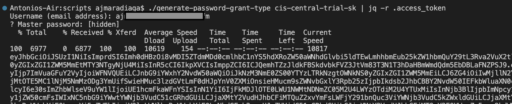

To automate some SAP BTP scripts, I've been using the great [`generate-password-grant-type` script](https://github.com/SAP-samples/cloud-btp-cli-api-codejam/blob/main/scripts/generate-password-grant-type) (created by my friend and colleague [@qmacro](https://github.com/qmacro)) to retrieve an access token. Unfortunately, or fortunately, authenticating with some accounts requires 2FA. Meaning that you need to append an OTP when specifying the account's password in the password field. This can be cumbersome when developing scripts, as you need to set this OTP. Bitwarden CLI to the rescue!



I use Bitwarden as my password manager, and it has a CLI :-). I've extended the script above to use the Bitwarden CLI when authenticating with a specific account. All I have to do when running the script is specify my master password, and it just works!

```bash
if [ $email != 'superaccount@company.com' ];
then
  read -rsp "Password for '$email': " password
else
  export BW_SESSION=$(bw unlock --raw)
  password=$(echo "$(bw get password 65no66u5-y4j8-4440-4ki6-m4763834cn45)$(bw get totp 65no66u5-y4j8-4440-4ki6-m4763834cn45)")
fi
```
