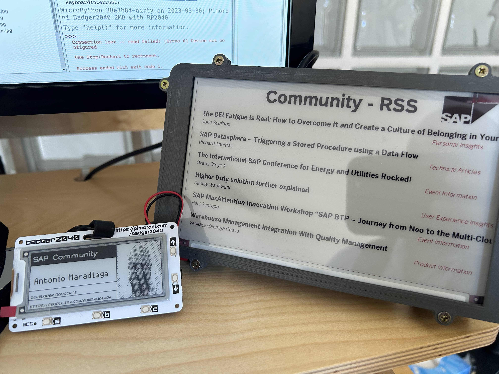
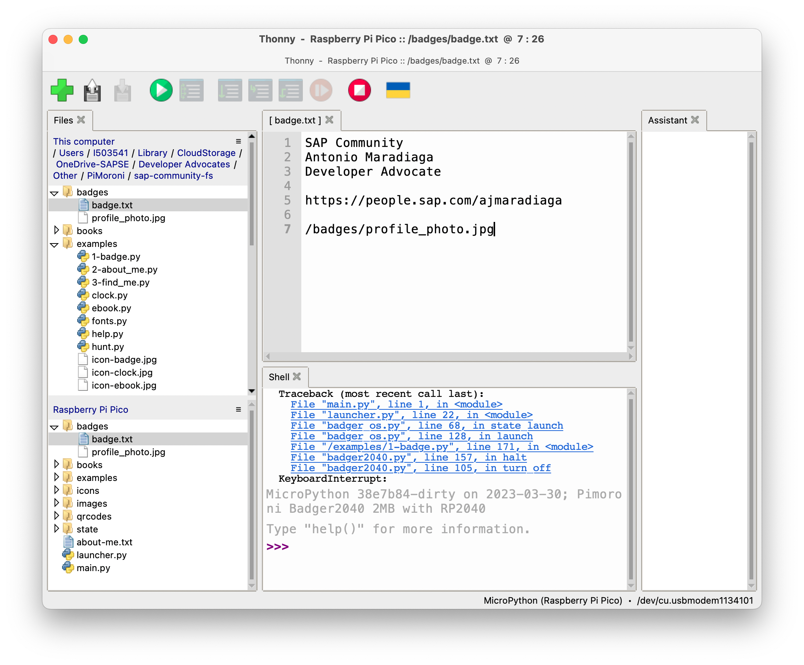
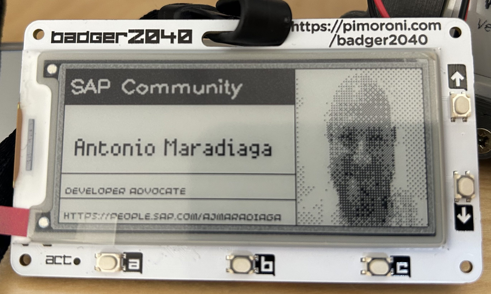
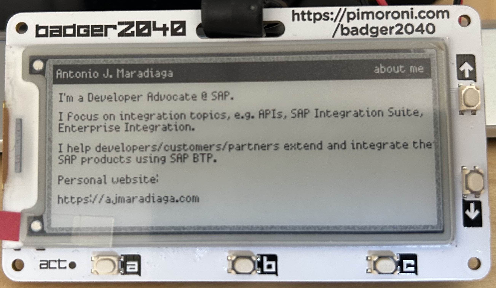

I'm very fond of e-ink devices. I like how reading on an e-ink device allows me to focus on the content. As much as I enjoy reading physical books, I enjoy the convenience and practicality of reading books on an e-ink device. On my phone, I've even set a colour filter ([a.k.a. grayscale mode](https://www.wired.com/story/grayscale-ios-android-smartphone-addiction/)) so that it looks more like an e-ink device and makes it a bit less distracting. I've even tried this on my laptop (not currently using it but I do switch to this mode now and then). In a previous blog post, I shared how you can keep up with the blog posts/news shared in SAP Community by using a Raspberry Pi 4 and an e-ink display ([SAP Community meets e-ink display: an RSS story](https://blogs.sap.com/2023/01/22/sap-community-meets-e-ink-display-an-rss-story/)).... and well, there is always space for another e-ink device 😃. Yesterday, I received a Pimoroni Badger 2040 and it's been a lot of fun to set it up with some of my details.

Let me show you some of the functionality that I've added to the device and what is it that you need to set one up for yourself.

## What do you need?

Below is what you will need:
- [Pimoroni Badger 2040 + Accessory kit](https://shop.pimoroni.com/products/badger-2040): The accessory kit contains a battery and a lanyard so that you can use it at your next conference/meetup ;-)
- [Thonny](https://thonny.org): Python IDE allows us to connect to the device, access the file system and modify/upload/download files.
  
- (Optional) Being familiar with Python, if you want to modify the scripts and add some additional functionality to the device.

## How to set up your SAP Community e-ink badge?

When I first plugged the device, I was able to see a limited number of files in Thonny, which seem a bit odd as I remember reading that there was some functionality available out of the box. That said, I remembered that it was possible to flash the device. So I proceeded to download [the latest version of the Pimoroni with Badger OS](https://github.com/pimoroni/badger2040/releases), flashed the device and then more files/functionality was available in the device.

> Detailed instructions on how to use Thonny and interacting with the device can be found in this great tutorial available in the Pimoroni website - [Getting Started with Badger 2040](https://learn.pimoroni.com/article/getting-started-with-badger-2040).  

I then proceeded to create a backup of all the files in the Pimoroni (because we are responsible developers and we always create backups of our data haha). This is as simple as right-clicking the folder/file in the device and saving them on your local computer.

> Unfortunately the device can be a bit flaky sometimes... it becomes unresponsive and I've had to unplug/plug back again the device to my laptop a number of times. Nothing too extreme but I've noticed the my "development flow/process" improved when modifying the files directly on the device and then just syncing back locally.  

Now, the files in the OS image include several cool examples, which I've used as a starting point to modify or create some of the functionality that I want on the badge. In my case, I want the following:
	- Badge
	- About Me: Include some information about myself.
	- Find Me: Simple app that displays QR codes containing links to my presence on the web, e.g. SAP Community, GitHub, LinkedIn, Twitter, etc.

### Badge
In the case of the badge, I used the same script (`/examples/badge.py`) and replaced the profile picture and the contents of the `/badges/badge.txt` file. I wasn't happy with the original font and end up using a different one.

### About Me
I created this script based on the `info.py` file. Instead of hard-coding the text within the script, the script now reads from a text file (`./about-me.txt`) the contents to be displayed.

### Find Me
I used the `qrgen.py` file as a base here. Removed the default text and added a few files under the `/qrcodes` folder to generate a QR code for the different websites where I have an online presence.

### Additional changes I've done
The launcher will show any `*.py` script under examples as an "app". In my case I wanted the apps to be displayed in a specific order. Therefore, I modified the `launcher.py` script to order the apps based on a number that can be prepended to the name.

> You might be wondering.... where is the code? I'm going through the process of publishing the repo, so that you can just clone it and get started fast. No Python skills required :-)  

Thanks for reading this far. If you have any suggestions on additional functionality/apps that can be added to the badge, I encourage you to share them with me via the comments below.