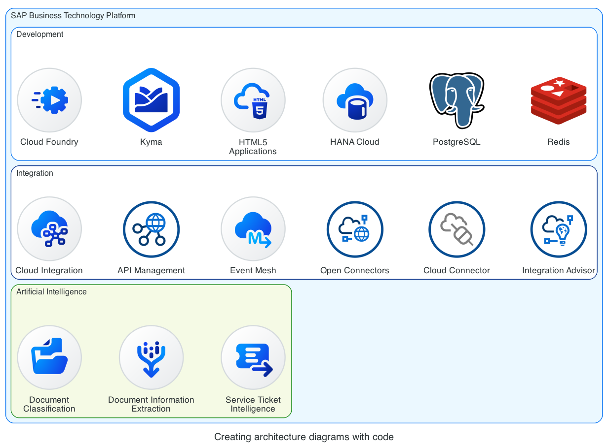
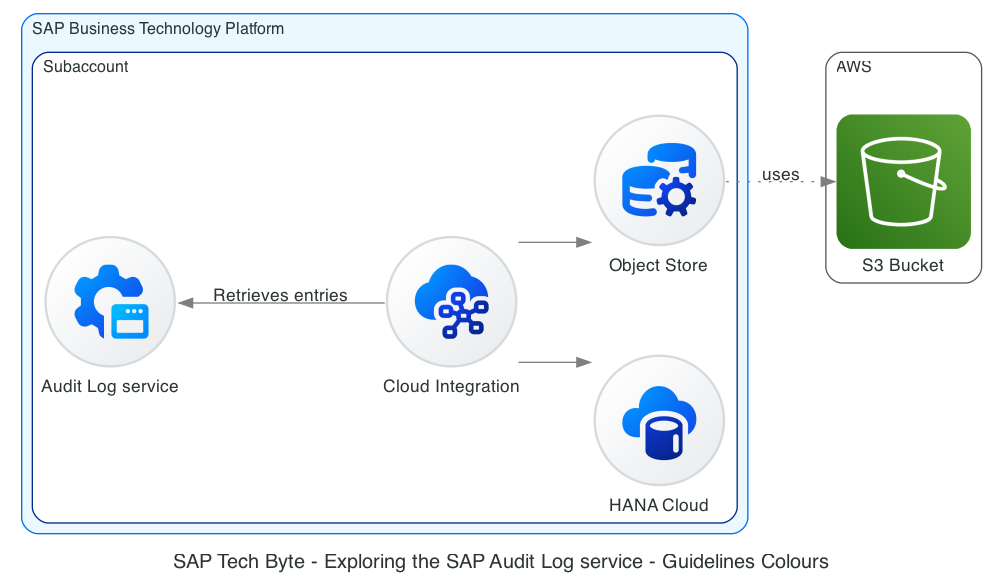

_In this blog post, I will share a quick update on the SAP icons part of the Diagrams fork repo. The sneak preview of the SAP BTP Solution Diagram icons, that were part of an SAP TechEd 2023 virtual session (XP286v), are now included in the Diagrams fork that you can use to create your SAP BTP architecture diagrams with code. Note: This blog post is related to Creating architecture diagrams with code - [https://blogs.sap.com/2022/06/29/creating-architecture-diagrams-with-code/](https://blogs.sap.com/2022/06/29/creating-architecture-diagrams-with-code/)._



As part of the virtual edition of SAP TechEd 2023, there was a session called XP286v - SAP Business Technology Platform Solution Diagrams. Given that I'm interested in the BTP Solution diagrams, it grabbed my attention and I noticed that there is a **sneak preview** of the next version of the SAP BTP Solution Diagram icons. Like most virtual sessions, the session has an accompanying GitHub repo, which contains the different exercises covered during the session - [https://github.com/SAP-samples/teched2023-XP286v](https://github.com/SAP-samples/teched2023-XP286v). The icons can be used when importing the _.drawio_ files available in the libraries folder part of exercise 0. I personally like the new icons very much.

> If you are interested in learning how you can extract the icons available in a Draw.io library, check out this blog post - [TIL - extracting SVG icons from a Draw.io file](https://ajmaradiaga.com/TIL-extracting-svg-icons-from-drawio-file/)

So, I invested a bit of time to refresh the icons in the [Diagrams fork](https://github.com/ajmaradiaga/diagrams/tree/sap-icons), which includes the SAP BTP icons, so that I can start producing diagrams using the new icons and that others who have used the project in the past can start using them.



> You'll notice in the first diagram that there are still some old icons included, e.g. API Management, Cloud Connector, Open Connectors, Integration Advisory. These icons are not included in the sneak preview but I consider them important and I use them in my diagrams. Hence, why I'm still including them in the repo.

Follow the steps below to refresh the repo on your machine...

```bash
# Switch to the directory where you've cloned the repo
$ cd diagrams

# Switch to the sap-icons branch
$ git checkout sap-icons

# Pull the latest changes
$ git pull origin sap-icons

# Build the project using poetry
$ poetry build

# Prepare your Python virtual environment
$ mkvirtualenv sap-diagrams

# Install the package in your virtual environment
$ poetry install --no-dev

# Now you can run one of scripts above locally. This will generate a png file with the output.
$ python tech-byte-diagram.py
```

I hope you are as excited as I am about the future of the SAP BTP Solution Diagrams. Looking forward to when they are released later this year :-)