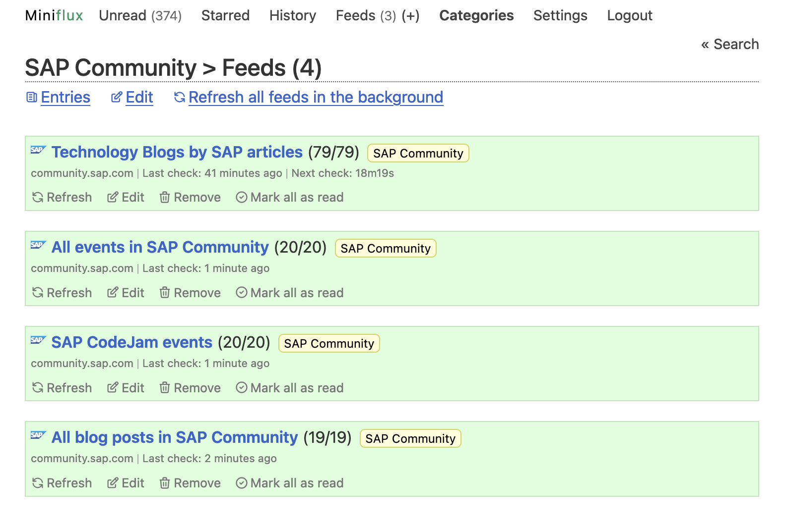
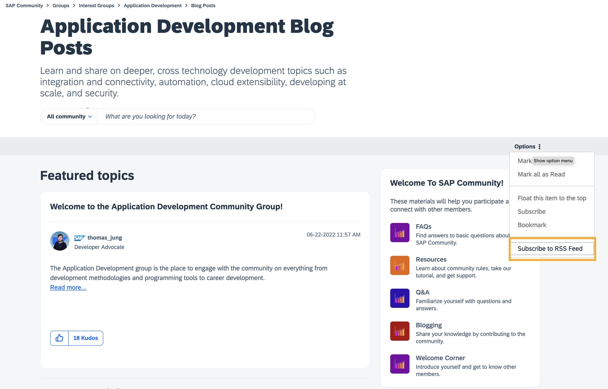
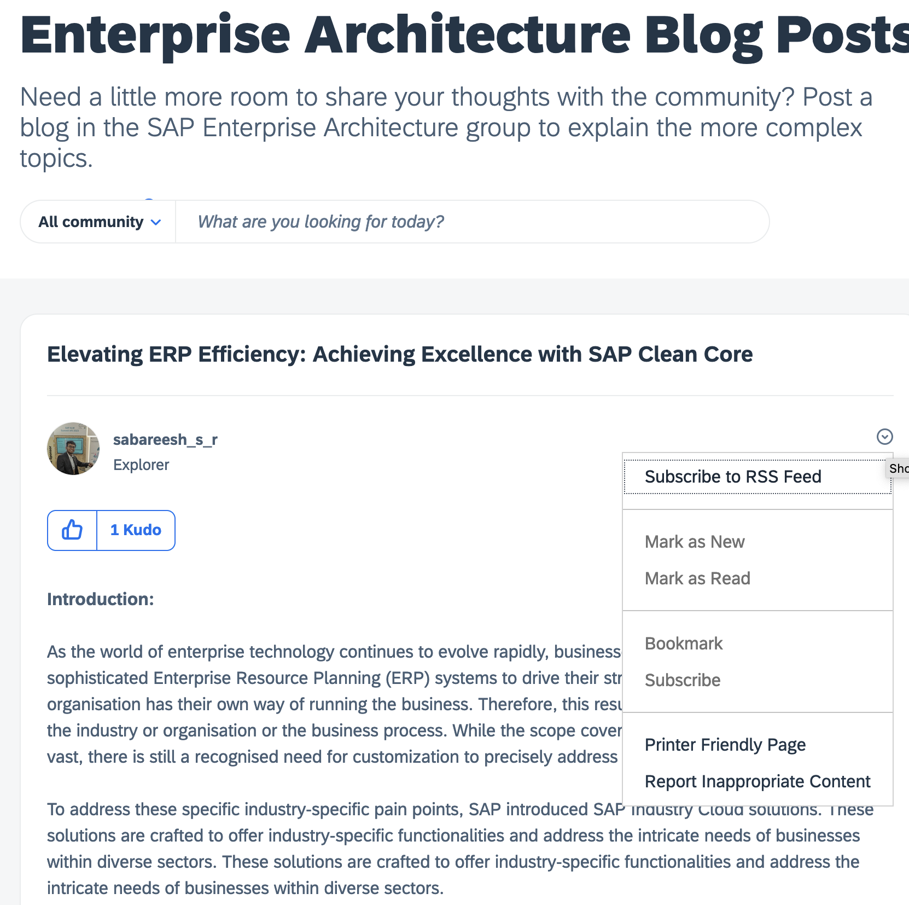

*In this blog post, I will share how you can subscribe via RSS feeds to different components/areas available in the new platform. Some feeds are easily accessible, others aren't :-).*

Due to the recent migration from the old SAP Community platform to the new SAP Community platform (powered by Khoros), I have been exploring how I can subscribe to different components/areas of the platform. I'm a huge fan of using RSS feeds to keep up to date with the latest content in SAP Community but things have changed a bit in the new platform. Below I will share my findings.

     
    <i>SAP Community RSS feeds</i>

**Why RSS and not just subscribe to the different areas?**

The new platform allows us to subscribe to different areas, but I prefer to use RSS feeds for a few reasons:
- Nowadays, we receive too many notifications and emails. I prefer to have a single place where I can see all the updates from different areas I'm interested in. In this case, my RSS reader (of course, [self-hosted](https://miniflux.app/)).
- I don't need to be notified immediately when something new is published.... I prefer the asynchronous nature of RSS.
- I do most of my reading on my RSS reader, so it's more convenient for me to have everything in one place.
- Integrations:
  - Some of the integrations that I've built use an RSS feed as a source. Yep, I have integrations consuming the SAP Community feeds :-).
  - I have integrations built on top of my RSS reader, so I can easily star/bookmark and create archives of the content that I find interesting.

## General RSS feeds

The new platform has a mechanism through which you can retrieve, based on content type, everything that's happening in the community. These can be accessed via `/rss/Community` path. Here we can filter the content by interaction style (blog, forum, occasion, tkb) and we can also specify if we want to include replies in the feed (`feeds.replies`) and the number of items that we want to retrieve (`count`).

> **Note**: The RSS feed URLs are based on the community ID. This is the ID that is part of the URL of the community. For example, the community ID for the SAP Community is `khhcw49343`. You'll see this community ID included in all URLs below.

Below are the RSS feeds, based on content types, that I have found so far:

- Everything that's happening in SAP Community: [https://community.sap.com/khhcw49343/rss/Community](https://community.sap.com/khhcw49343/rss/Community)
- All blog posts: [https://community.sap.com/khhcw49343/rss/Community?interaction.style=blog](https://community.sap.com/khhcw49343/rss/Community?interaction.style=blog)
- All questions: I believe that this was possible in the old platform but I haven't been able to find a feed that just includes all questions in the new platform. The best alternative will be to get everything that's happening in the community.
- All discussions: [https://community.sap.com/khhcw49343/rss/Community?interaction.style=forum](https://community.sap.com/khhcw49343/rss/Community?interaction.style=forum)
- All events: [https://community.sap.com/khhcw49343/rss/Community?interaction.style=occasion](https://community.sap.com/khhcw49343/rss/Community?interaction.style=occasion)
- All knowledge base articles: [https://community.sap.com/khhcw49343/rss/Community?interaction.style=tkb](https://community.sap.com/khhcw49343/rss/Community?interaction.style=tkb)

If you want to include replies in the feed and specify the numbers of items retrieved, you can do so by adding the `feeds.replies` and `count` parameters to the URL. For example, to get the last 42 blog posts with replies included, you can use the following URL: [https://community.sap.com/khhcw49343/rss/Community?interaction.style=blog&feeds.replies=true&count=42](https://community.sap.com/khhcw49343/rss/Community?interaction.style=blog&feeds.replies=true&count=42).

We've seen before how we can get the feed for the entire community. Now let's see how to get the feed for specific areas of the community.

## Boards

Within Khoros there is the concept of Boards. Within a board is where all content in a Khoros Community environment lives. Boards can be of different types of content, e.g. blog posts, discussions, events, questions, and knowledge base. This will vary depending on the area of the website you are visiting. For example, the [Enterprise Architecture](https://community.sap.com/t5/enterprise-architecture/gh-p/Enterprise-Architecture) interest group contains discussions, blog posts, events and knowledge base. Other areas, like the [Application Development](https://community.sap.com/t5/application-development/gh-p/application-development) interest group, contain only blog posts and discussions. We can get RSS feeds for each one of these boards by specifying the `board.id` in `/rss/board`, e.g. https://community.sap.com/khhcw49343/rss/board?board.id=application-developmentblog-board. The pattern followed to access the different content types via an RSS feed is: `https://community.sap.com/[COMMUNITY_ID]/rss/board?board.id=[BOARD-ID]`

> Some sections of the platform, e.g. Blogs, Q&A, Discussions, include an Options menu and within it there might be `Subscribe to RSS feed` option. This is the easiest way to get the feed for a specific section.

     
    <i>Subscribe to RSS feed link in board</i>

### Blog posts

Compared to the old platform, where there was a single place to create our blog posts, in the new platform there are MANY places where we can create them. In essence, every section of the community has a **separate** "blog area". We now have to be very careful about where we publish our blog posts as this will impact the reach/visibility they end up having. That said, "blogs" is a separate board so we can generate a feed using `/rss/board` and specifying the `board.id`.

- Examples:  
  - SAP CodeJam blog posts: 
    - Website: https://community.sap.com/t5/sap-codejam-blog-posts/bg-p/code-jamblog-board
    - RSS feed: https://community.sap.com/khhcw49343/rss/board?board.id=code-jamblog-board
  - Application Development board blog posts: 
    - Website: https://community.sap.com/t5/application-development-blog-posts/bg-p/application-developmentblog-board
    - RSS feed: https://community.sap.com/khhcw49343/rss/board?board.id=application-developmentblog-board

### Questions & Answers

Some areas in the platform include Q&A, e.g. Technology - https://community.sap.com/t5/technology/ct-p/technology, where you can ask and answer questions about SAP Business Technology Platform (SAP BTP). The questions and answers section is also a board so we can generate a feed using `/rss/board` and specifying the `board.id`. 

Examples:
- Enterprise Resource Planning:
  - Website: https://community.sap.com/t5/enterprise-resource-planning-q-a/qa-p/erp-questions
  - RSS feed: https://community.sap.com/khhcw49343/rss/board?board.id=erp-questions
- Technology:
  - Website: https://community.sap.com/t5/technology-q-a/qa-p/technology-questions
  - RSS feed: https://community.sap.com/khhcw49343/rss/board?board.id=technology-questions

### Discussions

Want to follow the discussions of a particular area in SAP Community?

Example:
- SAP CodeJam discussions:
  - Website: https://community.sap.com/khhcw49343/rss/board?board.id=code-jamforum-board
  - RSS feed: https://community.sap.com/khhcw49343/rss/board?board.id=code-jamforum-board
- Enterprise Architecture discussions: 
  - Website: https://community.sap.com/t5/enterprise-architecture-discussions/bd-p/Enterprise-Architectureforum-board
  - RSS feed: https://community.sap.com/khhcw49343/rss/board?board.id=Enterprise-Architectureforum-board

### Events

An RSS feed for events is also available. This is something that doesn't seem to be available via the UI but in the end, an event is just another type of board and we can get the RSS feed as if it was a board.

Examples: 
- SAP CodeJam events: 
  - Website: https://community.sap.com/t5/sap-codejam/eb-p/codejam-events
  - RSS feed: https://community.sap.com/khhcw49343/rss/board?board.id=codejam-events
- SAP Community Calls: 
  - Website URL: https://community.sap.com/t5/sap-community-calls/eb-p/community-calls
  - RSS feed: https://community.sap.com/khhcw49343/rss/board?board.id=community-calls
- Enterprise Architecture: 
  - Website: https://community.sap.com/t5/enterprise-architecture-events/eb-p/Enterprise-Architectureoccasion-board
  - RSS feed: https://community.sap.com/khhcw49343/rss/board?board.id=enterprise-architectureoccasion-board

### Knowledge Base

Some areas of SAP Community include a knowledge base. This in the end is a board again and you can get a feed by specifying the `board.id`.

Examples:
- Career Corner Job Opportunities :
  - Website: https://community.sap.com/t5/career-corner-job-opportunities/tkb-p/career-cornertkb-board
  - RSS Feed: https://community.sap.com/khhcw49343/rss/board?board.id=career-cornertkb-board
- Enterprise Architecture Knowledge Base:
  - Website: https://community.sap.com/t5/enterprise-architecture-knowledge-base/tkb-p/Enterprise-Architecturetkb-board
  - RSS feed: https://community.sap.com/khhcw49343/rss/board?board.id=Enterprise-Architecturetkb-board

## Messages

Each piece of content type can also be accessed as a "message" on the platform. We can subscribe to an RSS feed for a particular piece of content, e.g. a blog post, a discussion, or a knowledge base entry.

     
    <i>Subscribe to RSS feed link in message</i>

Examples:
  - Blog post - *Elevating ERP Efficiency: Achieving Excellence with SAP Clean Core*:
    - Website: https://community.sap.com/t5/enterprise-architecture-blog-posts/elevating-erp-efficiency-achieving-excellence-with-sap-clean-core/ba-p/13572668
    - RSS Feed: https://community.sap.com/khhcw49343/rss/message?board.id=Enterprise-Architectureblog-board&message.id=515
  - Knowledge base entry - 
*Become a Paid expert for PLATFORM TECHNOLOGIES – Ask an Expert Peer*:
    - Website: https://community.sap.com/t5/career-corner-job-opportunities/become-a-paid-expert-for-platform-technologies-ask-an-expert-peer/ta-p/127063
    - RSS feed: https://community.sap.com/khhcw49343/rss/message?board.id=career-cornertkb-board&message.id=33

> In the examples above you can see how we are specifying a particular board (`board.id`) and message identifier (`message.id`).

## Tags

There are many tags in the platform and we can retrieve content based on tags. You can subscribe to the RSS feed of a specific tag by using `/rss/search?q=tags:[tag-name]`. 

> Note: The feed will contain different content types, e.g. blog posts, questions. Here you can also specify the `count` query parameter explained previously.

Examples:
- ABAP Cloud: https://community.sap.com/khhcw49343/rss/search?q=tags:ABAP%20Cloud
- SAP Ariba Extensibility: https://community.sap.com/khhcw49343/rss/search?q=tags:SAP%20Ariba%20Extensibility
- SAP Integration Suite: https://community.sap.com/khhcw49343/rss/search?q=tags:SAP%20Integration%20Suite

## Users

In the previous platform, it was possible to generate a feed based on the activity of a specific user. This was very useful to me to check out the content created by some community members that I follow, it could be blog posts, comments or answers to questions. Unfortunately, I haven't found a way to do this on the new platform. If you know how to do this, please let me know in the comments. I'll update this section if I end up finding a way to achieve this.

---

I hope these findings useful for you as they are for me. Now go ahead and add some feeds to your favourite RSS reader :-).
