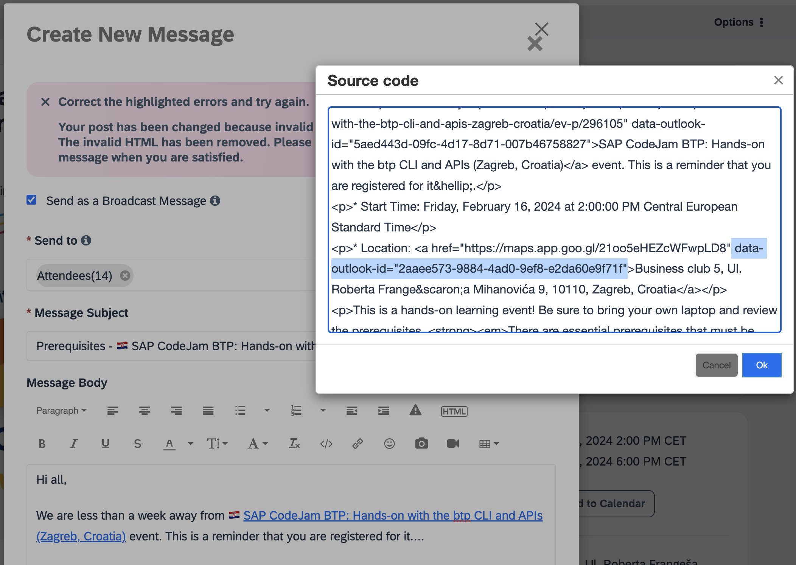

Today I was trying to send a message via Khoros to the people who have RSVPd for a couple of SAP CodeJams that I will be running in Zagreb, Croatia (([Integration Suite](https://community.sap.com/t5/sap-codejam/sap-codejam-btp-connecting-systems-and-services-using-sap-integration-suite/ev-p/296103), [btp CLI](https://community.sap.com/t5/sap-codejam/sap-codejam-btp-hands-on-with-the-btp-cli-and-apis-zagreb-croatia/ev-p/296105))) next week and I was getting the infamous invalid HTML error when drafting the message. Sometimes the platform automagically fixes the issue but in this case, I was still getting the message. When inspecting the HTML, I noticed an additional tag that I'd not seen before in an [HTML <a> tag](https://www.w3schools.com/tags/tag_a.asp). So, whenever you face this issue, check for any odd attributes that you might find in your HTML.

     
    <i>SAP Community - Invalid HTML error</i>

- **Problem**: I originally copied the message from Outlook and the hyperlinks (<a> tags) includes the additional attribute - `data-outlook-id`.
- **Solution**: This attribute `data-outlook-id` was causing the issue. Remove it from the HTML and it works fine.