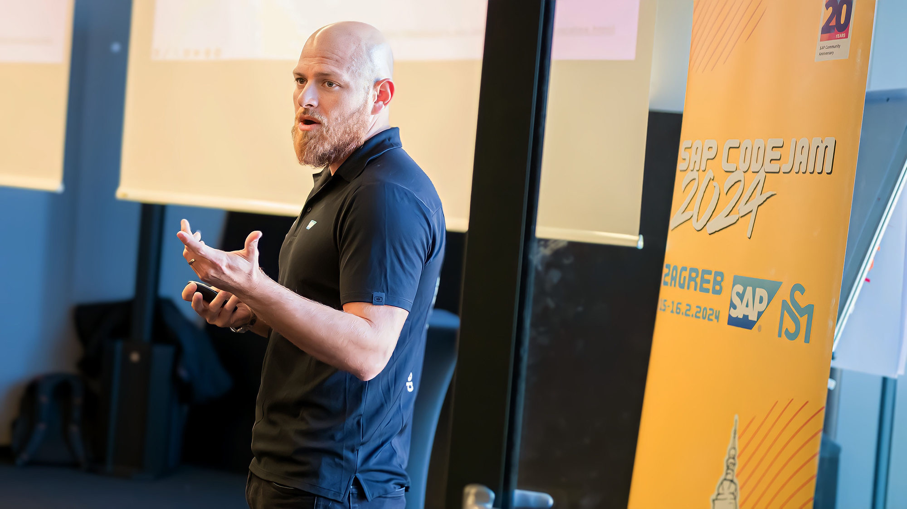
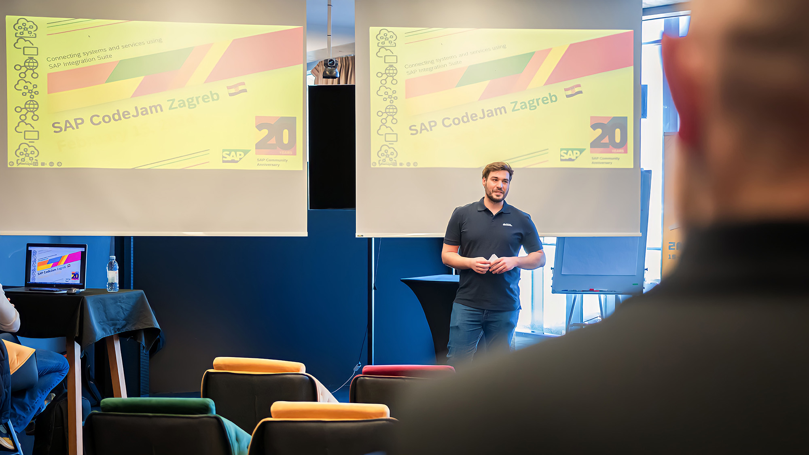
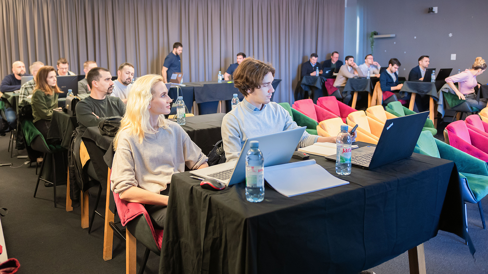
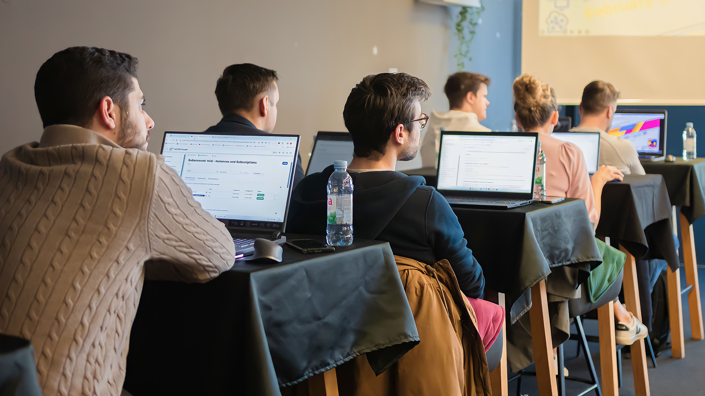
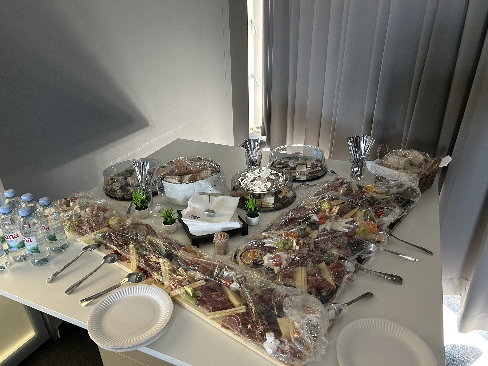
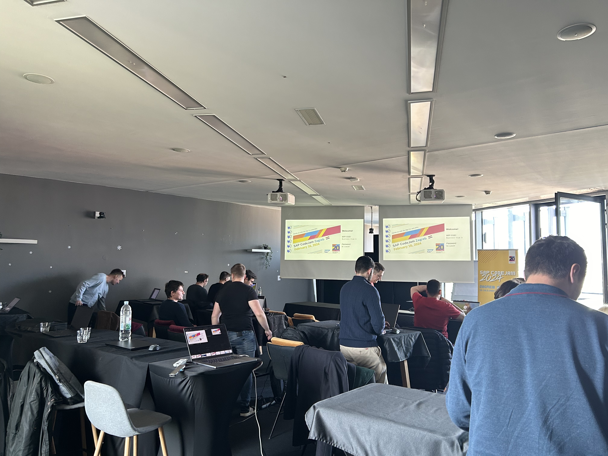
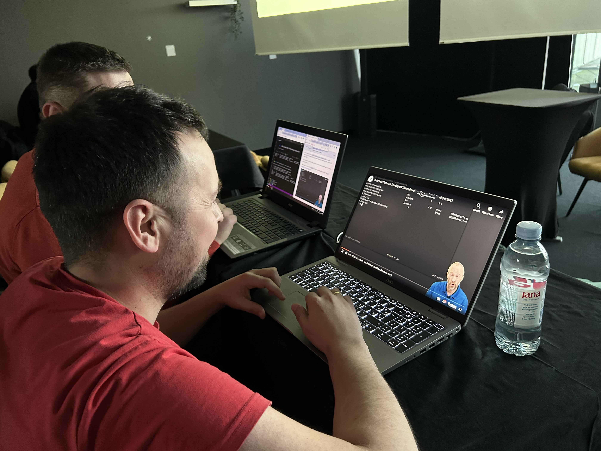
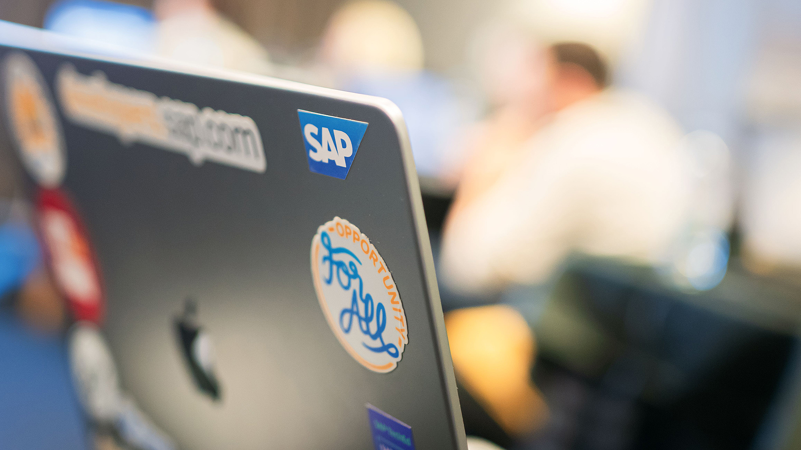

This week I had the opportunity to visit for the first time Zagreb, Croatia 🇭🇷 and run a couple of CodeJams there. On day 1, we did the [SAP Integration Suite CodeJam](https://community.sap.com/t5/sap-codejam/sap-codejam-btp-connecting-systems-and-services-using-sap-integration-suite/ev-p/296103) and on day 2, we focused on the [btp CLI and Core Service APIs CodeJam](https://groups.community.sap.com/t5/sap-codejam/sap-codejam-btp-hands-on-with-the-btp-cli-and-apis-zagreb-croatia/ec-p/296105#M205). This is the first time that these types of events have taken place in Zagreb and it was great to see the SAP BTP Community get together.

The events were kindly hosted by [Morgan Solutions](https://morgansolutions.eu/) who booked for us a nice venue, @ [Business Club 5 - Sky Office](https://maps.app.goo.gl/fehW8wRmHZykBWjE9), where we could work and provided plenty of delicious food and drinks as well. Thanks to the team at Morgan Solutions (Stjepan, Igor, Dino, Bojan, Darko, Guido), for all your efforts in organising the events :-).

Some of the attendees joined the events on both days. This makes me quite happy as they got enough value from the first day that they decided to return the second day :-). There was a great atmosphere on both days and I believe that attendees learned a lot and had a great time during the events. Something that is quite encouraging is that we also have some conversations around how they can host/organise future events, e.g. SAP CodeJams or even SAP TechEd/Devtoberfest watch parties.

Without a doubt, there is a bright future for the SAP Community in Zagreb. I'm looking forward to seeing how it evolves and grows in the near future.