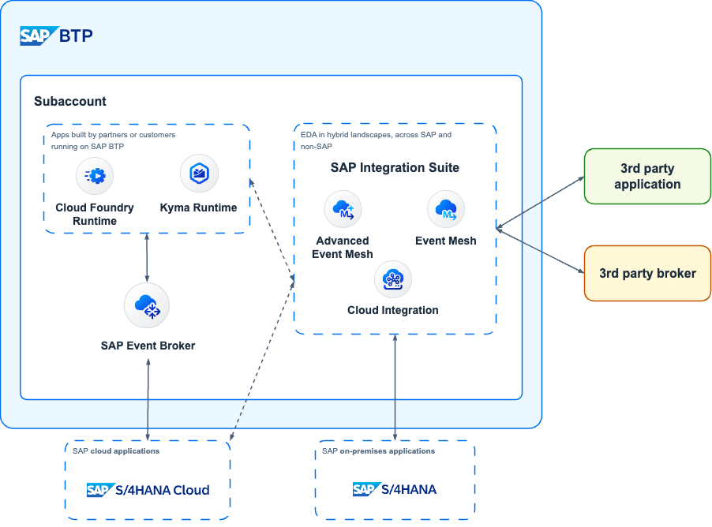
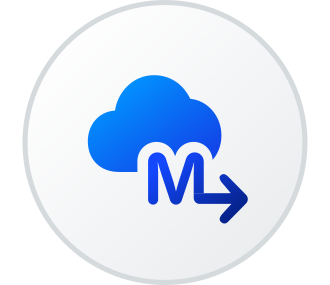

**TLDR;** *SAP is an [active contributor](https://github.com/cloudevents/spec/blob/main/docs/contributors.md) to the CloudEvents specification and it has adopted the specification for describing event data in common formats to provide interoperability across its services/applications/systems. In the [SAP Business Accelerator Hub](https://hub.sap.com/content-type/Events/events/packages), you can find all the events exposed by a total of 17 different SAP services that publish events following the specification, including its flagship ERP products, [SAP S/4HANA Cloud public edition](https://hub.sap.com/package/SAPS4HANACloudBusinessEvents/event) and [SAP S/4HANA](https://hub.sap.com/package/SAPS4HANABusinessEvents/event), exposing more than 280 events combined. To enable seamless event-based integrations between SAP applications, SAP applications must conform to the CloudEvents specification. SAP also offers three services, part of the SAP Business Technology Platform (SAP BTP), that can help customers embrace event-driven architectures, these are: [SAP Event Broker for SAP cloud applications](https://discovery-center.cloud.sap/serviceCatalog/sap-event-broker?region=all&service_plan=standard&commercialModel=cpea), [SAP Event Mesh](https://discovery-center.cloud.sap/serviceCatalog/event-mesh?region=all), and [SAP Integration Suite, advanced event mesh](https://discovery-center.cloud.sap/serviceCatalog/advanced-event-mesh?region=all).*

<p align = "center">
  <br/>
  <i>CloudEvents at SAP</i>
</p>

Before we dive into how CloudEvents have been adopted within SAP, we might need to talk a bit about what an Event-Driven architecture is and what a CloudEvent is as well. Let's get started.

## Event-Driven Architectures

Long gone are the days when a system (aka ***target system***) will constantly poll to check if there are any changes in another system, e.g. a new customer created in a master data system. Traditionally, the ***target system*** will only know this by programming a routine that will poll a file share and check for any files produced by this system or a web service exposed in the ***source system***, every X minutes/hours/days. The expectation nowadays is that systems are integrated and that the data exchanged between these systems will be immediately available in the ***target system(s)*** if any data is created/changed in the ***source system***.  Enter **Event-Driven architectures**.

An Event-Driven Architecture is a software architecture paradigm concerning the production and consumption of events. An event can be defined as a significant change in the state of an object within a system[^1]. For example, when a customer/supplier/employee (***business object***) is created/updated/deleted (***action***) in a system. Translating this to the SAP world, when a Business Partner is created/changed in SAP S/4HANA (***source system***), SAP S/4HANA can notify that there was a change in a business object and ***target system(s)*** interested in the Business Partner object can then react (do something about it) if they need to. This could be create/update/delete the object in their systems.

### How do source and target systems communicate?

Now, if the source system lets other systems know of any changes happening in its business objects, it will not be sustainable to create a new programming routine within the source system every time we want to notify a new target system of any changes. Traditionally we would have some form of middleware, e.g. SAP Cloud Integration, and configure our source system, an SAP S/4HANA system, to send notifications of these events to the middleware and then use the middleware to distribute these messages, e.g. we would add target system(s) as needed. Now, we are moving the problem from the source system to a sort of middleware but ideally, there will be a way for the source system to notify others without the need to make any changes. Enter the **event broker**.

*An event broker is message-oriented middleware that enables the transmission of events between different components of a system, acting as a mediator between publishers and subscribers. It is the cornerstone of event-driven architecture, and all event-driven applications use some form of event broker to send and receive information*[^2].

By introducing an event broker in our landscapes, we can configure our source systems to **publish** their events to this message-oriented middleware. The source system will specify the class of the message (aka **topic**). Then, systems interested in the changes happening, e.g. in a particular business object in the source system, can **subscribe** to the event(s), via the event broker, by specifying the topic they are interested in. There are two keywords important here, publish and subscribe (PubSub), this is a well-known messaging pattern used to decouple systems/applications and allow asynchronous communication between them.  

### What is the PubSub messaging pattern?

*Publish-subscribe is a communication pattern that is defined by the decoupling of applications, where applications publish messages to an intermediary broker rather than communicating directly with consumers (as in point-to-point)*[^3]. In a way, publishers and consumers do not need to know each other; they simply publish (produce) or consume (receive) the events. When following this messaging pattern we move from, the traditional polling mechanism to know if there have been any changes in the source system, to reacting to real-time events (notifications) the moment something happens in the source system.

<p align = "center">
  <br/>
  <i>PubSub messaging pattern</i>
</p>

We mentioned before how target systems can subscribe to events by specifying a topic they are interested in.... some event brokers will allow subscribers to subscribe to topics by using wildcards (*) and they will be able to receive events for different topics. For example, let's assume we have an SAP S/4HANA with the name `S4D` and it publishes the Business Partner create and change on the following topics: `sap/S4HANAOD/S4D/ce/sap/s4/beh/businesspartner/v1/BusinessPartner/Created/v1` and `sap/S4HANAOD/S4D/ce/sap/s4/beh/businesspartner/v1/BusinessPartner/Changed/v1`. A subscriber system could subscribe to both topics using a wildcard, e.g. `sap/S4HANAOD/S4D/ce/sap/s4/beh/businesspartner/v1/BusinessPartner/*/v1` and receive the messages for both event types.

> SAP offers different services that can act as event brokers. We will discuss this further in the [SAP's event-driven portfolio](./cloud-event-at-sap.md#saps-event-driven-portfolio) section.

With many systems in our landscapes and each one being developed by different vendors/teams, it would be good if there was a standard way of structuring these events to simplify how systems create/handle/process these messages right? Enter [CloudEvents](https://CloudEvents.io/).  

## What is CloudEvents?

<p align = "center">
  <br/>
  <i>CloudEvents</i>
</p>

Today's system landscapes are very complex and we need to deal with many systems communicating with each other, ideally as close to real-time as possible. Nowadays, a system can publish events to notify other systems of the changes happening within the objects of their system. Given that we are talking of many systems, ideally, there will be a common way of describing the data produced by these systems. The CloudEvents specification can help us with this. We can leverage it to provide a consistent way for how our systems can communicate with others about these events.

As mentioned on the [CloudEvents website](https://CloudEvents.io/)... *CloudEvents is a specification for describing event data in a common way. It's goal is to simplify event declaration and delivery across services, platforms and beyond! The specification is now under the [Cloud Native Computing Foundation](https://cncf.io/)*.

Below is an example of what a CloudEvent message will look like:
```json
{
  "specversion" : "1.0",
  "type" : "com.github.pull_request.opened",
  "source" : "https://github.com/cloudevents/spec/pull",
  "subject" : "123",
  "id" : "A234-1234-1234",
  "time" : "2018-04-05T17:31:00Z",
  "comexampleextension1" : "value",
  "comexampleothervalue" : 5,
  "datacontenttype" : "text/xml",
  "data" : "<much wow=\"xml\"/>"
}
```

You'll notice that the example above is composed of many attributes. These attributes describe the event and are independent of the event data. Meaning that we can somehow process/inspect the event without needing to process its data. Now, let's dive a bit into the message itself.

> For more information on the history, development and design rationale behind the specification, see the [CloudEvents Primer](https://github.com/cloudevents/spec/blob/v1.0.2/cloudevents/primer.md) document.

## CloudEvents message format

A CloudEvent message is mainly composed of context attributes and data.

### Context Attributes

A number of attributes can be included within the message, these attributes are known as [Context Attributes](https://github.com/cloudevents/spec/blob/v1.0.2/cloudevents/spec.md#context-attributes) and the idea is that these context attributes can be used to describe the event. We can think of these context attributes as the header information of our event. Let's explore some of the attributes available.

| Name | Required | Description | Example |
| ---- | ----- | ---- | --- |
| id | ✅ | Identifies the event. Producers MUST ensure that source + id is unique for each distinct event. | 63d6a150-c6a1-4c5b-bcc3-27d90c07941c |
| source | ✅ | Identifies the context in which an event happened. | /default/sap.s4.beh/244572008 |
| specversion | ✅ | The version of the CloudEvents specification which the event uses. | `1.0` |
| type | ✅ | Describes the type of the event | `sap.s4.beh.businesspartner.v1.BusinessPartner.Changed.v1` |
| datacontenttype | | Content type of the value in data. | `application/json` |


#### Extension Context Attributes
A CloudEvent message may also include additional context attributes, which are not defined as part of the specification. These additional attributes are known as "extension attributes" and can be used by the producer systems to include additional metadata to an event, similar to how we can use HTTP custom headers.

For example, in the [SAP Digital Vehicle Hub Business Events package](https://hub.sap.com/event/SAPDigitalVehicleHubBusinessEvents_SAPDigitalVehicleHubBusinessEvents), we can see that the event raised when a vehicle changes - `sap.dmo.dvh.Vehicle.Changed.v1`, contains the extension context attribute `sappassport`, which is an SAP specific tracing identifier.

```json
{
  "specversion": "1.0",
  "type": "sap.dmo.dvh.Vehicle.Changed.v1",
  "source": "/eu10/sap.dmo.dvh",
  "subject": "808E6E30B65149978A443429B29FB300",
  "id": "a823e884-5edc-4194-a81a-f3a3632417ee",
  "time": "2018-04-08 08:31:00",
  "datacontenttype": "application/json",
  "sappassport": "string",
  ....
}
```

### Data

A CloudEvent message may include a payload but this is not required. If included it will be in the format specified in the `datacontenttype` context attribute. Although it is not required, we will generally have a payload in messages. Below we can see an example of an event message that contains a payload. In this case, a Business Partner changed event generated by an SAP S/4HANA Cloud Public Edition.

```json
{
    "type": "sap.s4.beh.businesspartner.v1.BusinessPartner.Changed.v1",
    "specversion": "1.0",
    "source": "/default/sap.s4.beh/244572008",
    "id": "63d6a150-c6a1-4c5b-bcc3-27d90c07941c",
    "time": "2024-02-26T10:53:06Z",
    "datacontenttype": "application/json",
    "data": {
        "BusinessPartner": "1000667"
    }
}
```

> Check out the Business Partner changed event in the SAP Business Accelerator Hub - [https://hub.sap.com/event/CE_BUSINESSPARTNEREVENTS/resource](https://hub.sap.com/event/CE_BUSINESSPARTNEREVENTS/resource).

## SAP's adoption of CloudEvents

SAP is an [active contributor](https://github.com/cloudevents/spec/blob/main/docs/contributors.md) to the CloudEvents specification and one of its many [adopters](https://cloudevents.io/). Evidence of that is the different products ([event packages](https://hub.sap.com/content-type/Events/events/packages)) that we can find documented in the [SAP Business Accelerator Hub > Events category](https://hub.sap.com/content-type/Events/events/events). 

The products listed below document their events in the form of event packages in the [SAP Business Accelerator Hub](https://hub.sap.com/). All their events follow the CloudEvents specification:
- SAP Agricultural Origination Portal
- SAP Batch Release Hub for Life Sciences
- SAP Cell and Gene Therapy Orchestration
- SAP Cloud for Utilities Foundation
- SAP Digital Vehicle Hub
- SAP GRC Cloud - Issue Management and Remediation Service
- SAP Industry Process Framework
- SAP Intelligent Clinical Supply Management for Operations
- SAP Intelligent Clinical Supply Management for Planning
- SAP Landscape Management Cloud
- SAP Marketing Cloud
- SAP Order Management Foundation
- SAP S/4HANA
- SAP S/4HANA Cloud Public Edition
- SAP S/4HANA Utilities for Customer Engagement
- SAP S/4HANA for Procurement Planning Cloud
- SAP Subscription Billing

SAP's flagship ERP products, SAP S/4HANA Cloud Public edition and SAP S/4HANA, expose more than 280+ events combined. As you might have noticed from the events that we use as examples above, these events follow the CloudEvents specification. Below we can see the Business Partner Created event generated by an SAP S/4HANA Cloud Public Edition and we can see how it follows the CloudEvents specification.

```json
{
    "type": "sap.s4.beh.businesspartner.v1.BusinessPartner.Created.v1",
    "specversion": "1.0",
    "source": "/default/sap.s4.beh/244572008",
    "id": "194780e0-b5db-1ede-b58a-4550178dff9e",
    "time": "2024-02-26T09:50:00Z",
    "datacontenttype": "application/json",
    "data": {
        "BusinessPartner": "1000667"
    }
}
```

## SAP's event-driven portfolio

<p align = "center">
  <br/>
  <i>SAP event-driven portfolio</i>
</p>

SAP offers various services that can help customers embrace event-driven architectures. The different offerings can meet customers where they are in their EDA adoption/implementation journey. These are:
- SAP Event Broker for SAP cloud applications
- SAP Event Mesh
- SAP Integration Suite, advanced event mesh

### [SAP Event Broker for SAP cloud applications](https://discovery-center.cloud.sap/serviceCatalog/sap-event-broker?region=all&service_plan=standard&commercialModel=cpea)

<p align = "center">
  <br/>
  <i>SAP Event Broker for SAP cloud applications</i>
</p>

SAP Event Broker is the latest service released by SAP that focuses on event-driven architecture and it supports event-based integration between SAP cloud and BTP-based applications. It is a fully managed cloud service that allows SAP cloud applications to communicate asynchronously through events. Meaning it can be used to distribute events between SAP cloud applications. For example, this service can be leveraged to enable seamless integration between [SAP S/4HANA Cloud public edition and SAP Subscription Billing](https://help.sap.com/docs/CLOUD_TO_CASH_OD/559eeb1cc256428c9bb3b9cf9f3480ba/6407b895ff9f4be6a4d417db2226eae4.html?locale=en-US). When an integration scenario leverages SAP Event Broker, it eliminates having to configure an event storage or infrastructure such as customer-defined topics or queues to enable the event-based integration between systems.

<p align = "center">
  <br/>
  <i>Integration between SAP S/4HANA Cloud and SAP Subscription Billing</i>
</p>

CloudEvents are first-class citizens in SAP Event Broker, as events that are distributed between SAP cloud applications using SAP Event Broker all conform to the [CloudEvent Specification](https://github.com/cloudevents/spec/blob/v1.0.2/cloudevents/spec.md)[^4].

If all your event needs are within the SAP cloud world, e.g. exchange events between SAP cloud applications and SAP BTP, this service can fulfill your needs.

### [SAP Event Mesh](https://discovery-center.cloud.sap/serviceCatalog/event-mesh?region=all)

<p align = "center">
  <br/>
  <i>SAP Event Mesh</i>
</p>

SAP Event Mesh allows applications to communicate through asynchronous events. It can be used to publish and consume business events from SAP and non-SAP sources across hybrid landscapes from the digital core (ERP products, e.g. SAP S/4HANA Cloud public edition and SAP S/4HANA) to extension applications through event-driven architecture. It is a fully managed [centralised event-oriented](https://help.sap.com/docs/event-mesh/event-mesh/event-mesh-default-plan-concepts?locale=en-US) service part of SAP BTP.

<p align = "center">
  <br/>
  <i>SAP Event Mesh</i>
</p>

The [service supports the use of REST APIs for Events](https://help.sap.com/docs/event-mesh/event-mesh/rest-apis-for-events?locale=en-US), for publishing and consuming events that are compliant with the CloudEvents specification. Related to event-based integrations, events that flow through SAP Event Mesh between SAP applications must all conform to the CloudEvents specification. 

> You can check out how to enable the consumption of SAP S/4HANA Cloud public edition events in your SAP BTP account - https://youtu.be/4LspIL3NxqQ

### [SAP Integration Suite, advanced event mesh](https://discovery-center.cloud.sap/serviceCatalog/advanced-event-mesh?region=all) (AEM)

<p align = "center">
  <br/>
  <i>SAP Integration Suite, advanced event mesh</i>
</p>

SAP Integration Suite, advanced event mesh (AEM) is a complete event streaming, event management, and monitoring platform that incorporates best practices, expertise, and technology for event-driven architecture (EDA) on a single platform. With AEM you can deploy event broker services, create event meshes, and optimize and monitor your event-driven system.

AEM offers these categories of services:
- **Event Streaming**: It provides event streaming services and gives you access to event broker services that provide advanced features like the publish-subscribe messaging pattern, queuing, streaming, replay, and request-reply, while doing all the heavy lifting to dynamically deploy, upgrade, patch, and operate the service. It extends beyond the cloud and supports infrastructure and EDAs across hybrid cloud solutions and your on-premises deployments. 
  > Event brokers can be deployed to: public clouds administered by SAP (Public Regions or Dedicated Regions) and customer's own regions in the cloud or on-premises (Customer-Controlled Regions)
- **Event Management**: It provides event management services. The Event Portal provides powerful tools to create, design, share, and manage various aspects of your EDA based on event brokers or other streaming technologies. It fully supports the AsyncAPI 2.0.0 specification so that you can generate code, documentation, validate events, and apply API management policies for applications in your EDA.

  > You might have noticed that some event specification in the SAP Business Accelerator Hub are documented using the AsyncAPI specification, e.g. [Marketing Campaign Events](https://hub.sap.com/event/CE_MARKETINGCAMPAIGNEVENTS/overview) part of SAP Marketing Cloud.
- **Event Monitoring and Insights**: Availability out-of-the-box of dashboards and easy-to-understand visualizations based on historical and real-time metrics, and timely notifications about the event broker services deployed.

Similar to SAP Event Mesh, it can be used to publish and consume business events from SAP and non-SAP sources across hybrid landscapes. Meaning, if your event data needs to exit the SAP cloud world, you can use any of these two services.

----

Thanks for making it this far, we've covered a lot in this blog post and I hope it gives you a general understanding of CloudEvents, its importance in the SAP world, how it can enable integration across SAP applications and the different SAP offerings that can enable your EDA journey.

[^1]: Event-Driven architecture: [link](https://en.wikipedia.org/wiki/Event-driven_architecture)
[^2]: What is an event broker?: [link](https://solace.com/what-is-an-event-broker/).
[^3]: What is the publish-subscribe messaging pattern?: [link](https://solace.com/blog/publish-subscribe-messaging-pattern/)
[^4]: SAP Event-Driven integrations: [link](https://help.sap.com/docs/event-broker/event-broker-service-guide/event-driven-integrations?locale=en-US%3Fversion%3DCloud). 