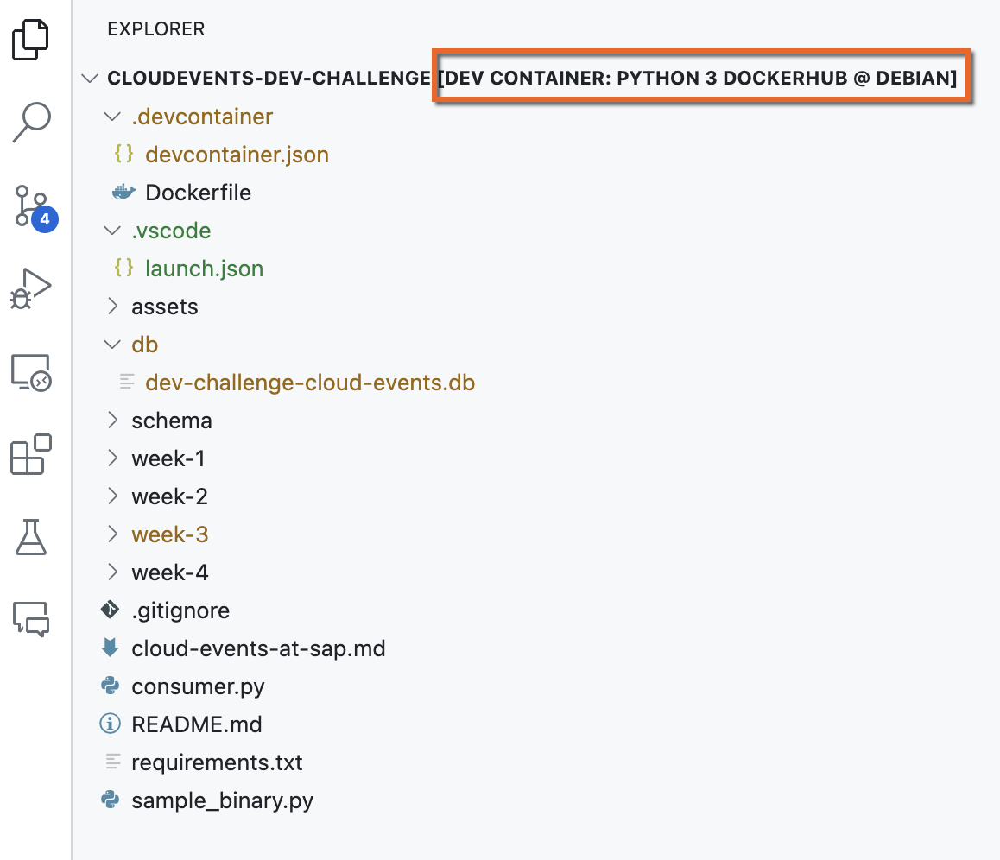

The past few days I've been developing a couple of things that involve a [Python library](https://pypi.org/project/solace-pubsubplus/#files) which has no binary available for my architecture (`arm64`). That said, there is a binary available for `amd64` and everything works just fine on that architecture. So I thought.... how can I develop locally but still being able to use that library only available for `amd64`? Given that I use Visual Studio Code, the next logical step is using a Dev Container.

<p align = "center">
  <br/>
  <i>Dev Container running remotely</i>
</p>


## Dev Containers

*The Visual Studio Code Dev Containers extension lets you use a container as a full-featured development environment. It allows you to open any folder inside (or mounted into) a container and take advantage of Visual Studio Code's full feature set[^1]*. In essence, you develop locally and your code runs in a local containerised environment.

<p align = "center">
  <br/>
  <i>Dev Container running locally</i>
</p>

I created a `devcontainer.json` and specified that it should run on the amd64 architecture. 

```docker
FROM --platform=linux/amd64 mcr.microsoft.com/devcontainers/python:1-3.12-bullseye

CMD ["echo", "The python:3.12.2-slim-bullseye image is working!"]
```

Now, I was able to install the library and run the program using the local Dev Container running on the amd64 architecture ([--platform=linux/amd64](https://ajmaradiaga.com/TIL-Running-Linux-DevContainers-in-AppleSilicon/)) but a new issue arrived. I was unable to install VS Code extensions in this local Dev Container. No matter what, not a single extension was installed in it. It wasn't an issue with internet connectivity (proxies) and I wasn't able to find an explanation on why this was happening. I've worked with Dev Containers in others projects and installing extensions on it just works.

> After wasting more hours than what I would like to admit ⏳⏳⏳......

This new issue got me thinking.... can the problem be that the Dev Container is running on a different architecture (`amd64`) than my local architecture (`arm64`)? What if the Dev Container runs on the same local architecture (`amd64` on `amd64`)? In the past, I've used the [Remote Development using SSH](https://code.visualstudio.com/docs/remote/ssh) functionality to develop on a Raspberry PI and it works just fine... but you require SSH access and your code needs to live on that machine. That said, you can use this mechanism to run a [Dev Container there as well](https://code.visualstudio.com/docs/remote/ssh#_open-a-folder-on-a-remote-ssh-host-in-a-container).

Now, I recently learnt about an alternative....having your code locally but running a Dev Container remotely by using a tunnel. Enter [Remote Tunnels](https://code.visualstudio.com/docs/remote/tunnels).

## Remote Tunnels

*The Visual Studio Code Remote - Tunnels extension lets you connect to a remote machine, like a desktop PC or virtual machine (VM), via a secure tunnel. You can connect to that machine from a VS Code client anywhere, without the requirement of SSH[^2]*. The tunnel uses [Microsoft dev tunnels](https://learn.microsoft.com/azure/developer/dev-tunnels/overview) to establish the communication between your local VS Code and the VS Code in the remote machine. For this, you will need to authenticate using a [GitHub or Microsoft account](https://code.visualstudio.com/docs/remote/tunnels#_how-are-tunnels-secured).

<p align = "center">
  <br/>
  <i>Dev Container running remotely</i>
</p>

In order to set this up you need to have access to a remote machine/VM. In my case, a remote VM that runs the desired architecture (`amd64`). Fortunately, I have an [Unraid server](https://docs.unraid.net/unraid-os/manual/vm-management/) at home, where I spun up a Debian VM and I can run a remote tunnel by using the VS Code CLI. It was a matter of downloading the CLI, install it, authenticate and of you go.

```bash
sudo apt install ./<file>.deb

# Run tunnel
code tunnel

# Run tunnel as a service
code tunnel service install

# Check tunnel logs
code tunnel logs
```

What's great about this approach is that the code stays in the client and you can run the Dev Containers in the right architecture on the remote machine.

[^1]: Developing inside a container: [link](https://code.visualstudio.com/docs/devcontainers/containers).
[^2]: Developing with Remote Tunnels: [link](https://code.visualstudio.com/docs/remote/tunnels).