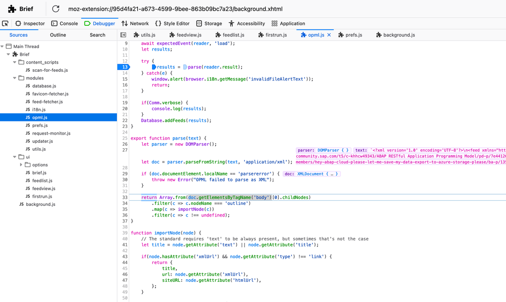

An [SAP community member](https://community.sap.com/t5/what-s-new/additional-sap-community-feeds/bc-p/13632953/highlight/true#M415) was facing an issue when trying to import an RSS feed in the [Brief Firefox extension](https://github.com/brief-rss/brief). I was curious to learn why it was failing which got me thinking... How can I [debug an extension in Firefox](https://extensionworkshop.com/documentation/develop/debugging/)? 

Steps:

- Enter `about:debugging` in the URL bar.
- In the left-hand menu, click `This Firefox`.
- Click Inspect next to the extension.

   
  <i>Debugging Brief Firefox extension</i>

Check out why it was failing... [https://community.sap.com/t5/what-s-new/additional-sap-community-feeds/bc-p/13633765/highlight/true#M416](https://community.sap.com/t5/what-s-new/additional-sap-community-feeds/bc-p/13633765/highlight/true#M416).