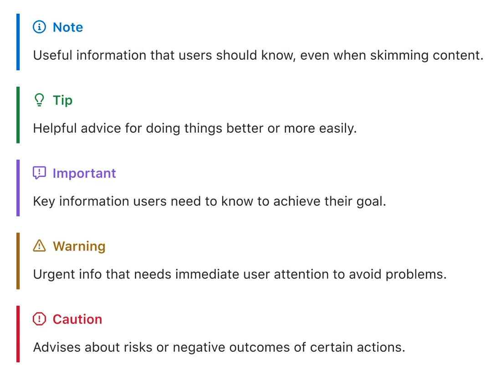

   
  <i>Alerts - GitHub Markdown extension</i>

Whenever I've written technical documentation using Markdown, there have been instance where I wanted to communicate something extra and for that I normally use blockquotes. Although a blockquote does give special emphasis to the text from the rest of the content, I've found myself wanting to do particular emphasis on something. For that, I've used different methods like using bold text, italic text, or emojis (📝, 🧭, 🚨). That said, I've never been quite satisfied with it. Fortunately, I bumped into GitHub Alerts today - [https://docs.github.com/en/get-started/writing-on-github/getting-started-with-writing-and-formatting-on-github/basic-writing-and-formatting-syntax#alerts](https://docs.github.com/en/get-started/writing-on-github/getting-started-with-writing-and-formatting-on-github/basic-writing-and-formatting-syntax#alerts), thanks to how Vadim Klimov is using it in his repo - [CPI Navigator](https://github.com/vadimklimov/cpi-navigator).

> [!NOTE]
> Alerts are a Markdown extension based on the blockquote syntax that you can use to emphasize critical information.

What I like about it is that it is such a simple change that can make a big difference. It is a great way to highlight something and communicate importance of the information to the reader. I'm looking forward to using it in future content I create and I've started updating existing content to include this. Check out how it is being used in this exercise - [https://github.com/SAP-samples/event-driven-integrations-codejam/tree/main/exercises/01-events-sap-ecosystem](https://github.com/SAP-samples/event-driven-integrations-codejam/tree/main/exercises/01-events-sap-ecosystem).