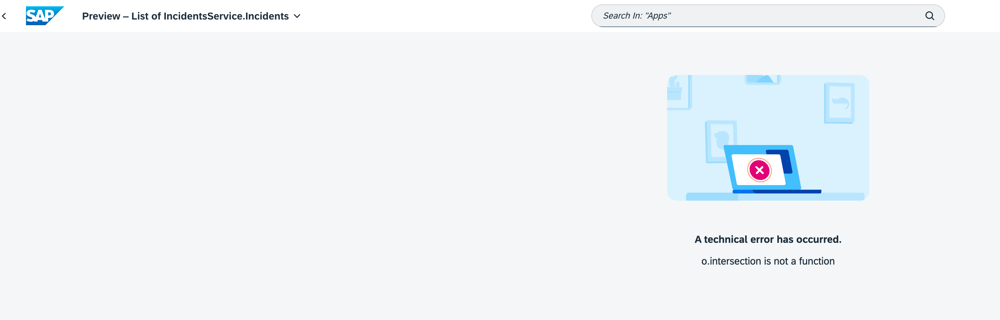
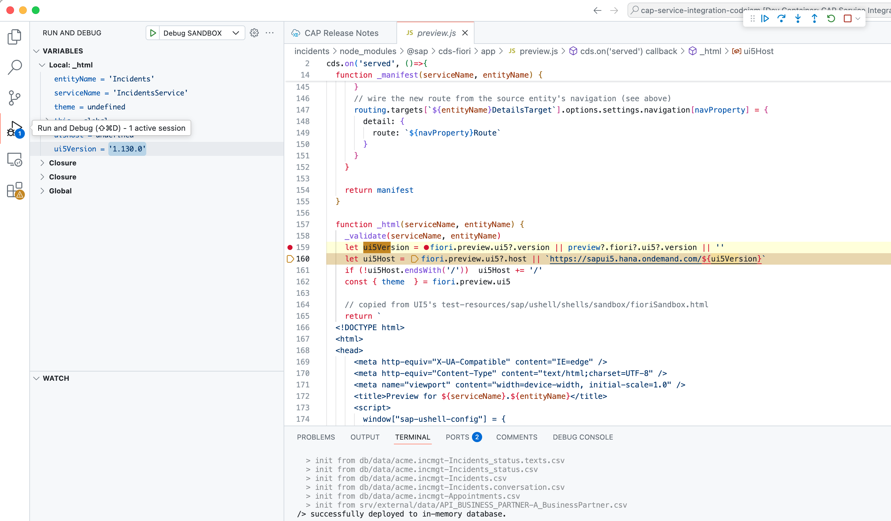
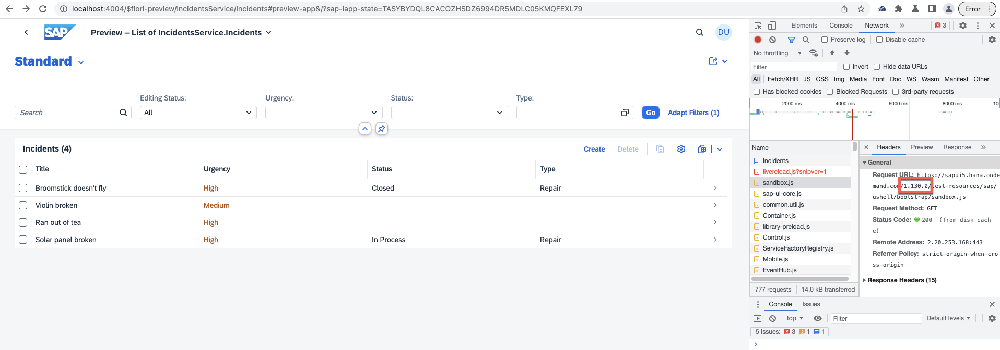

Today I was running a very simple CAP service, which is part of the [Service integration with SAP Cloud Application Programming model CodeJam](https://github.com/SAP-samples/cap-service-integration-codejam). When running the Fiori preview for an entity, I was always getting an error message in the console: `TypeError: o.intersection is not a function`. This error was being raised by the Fiori preview independent of the entity that I was trying to preview. That made me thing that the issue was not with the entity but with the Fiori preview itself. 

<p align = "center">
  <br/>
  <i>Fiori preview error</i>
</p>

Based on the network requests that I was able to see in the Developer Tools, I knew it was using version 1.132.0 of SAP UI5. Then I thought... let's force the project to use a different version to see if the error would go away. I debugged the CAP project and I knew exactly where was the version of SAP UI5 being set. I set the variable to 1.130.0 and the preview worked fine. Nice!

<p align = "center">
  <br/>
  <i>Debug forcing version</i>
</p>


Now, I don't want to debug the project every time and manually set the version.... digging deeper, I found out that the [@sap/cds-fiori](https://www.npmjs.com/package/@sap/cds-fiori) module has a `package.json`, where the version of SAP UI5 is set. It is well known that you can set [project-specific configuration](https://cap.cloud.sap/docs/node.js/cds-env#in-env) via a `.env` file. So, I created a `.env` file in the root of the project and set the following content:

```env
cds.fiori.preview.ui5.version=1.130.0
```

By setting that environment variable I'm forcing the project to use version 1.130.0 of SAP UI5 when running the Fiori preview. I restarted the project and the preview worked fine.

<p align = "center">
  <br/>
  <i>Fiori preview running specific version</i>
</p>