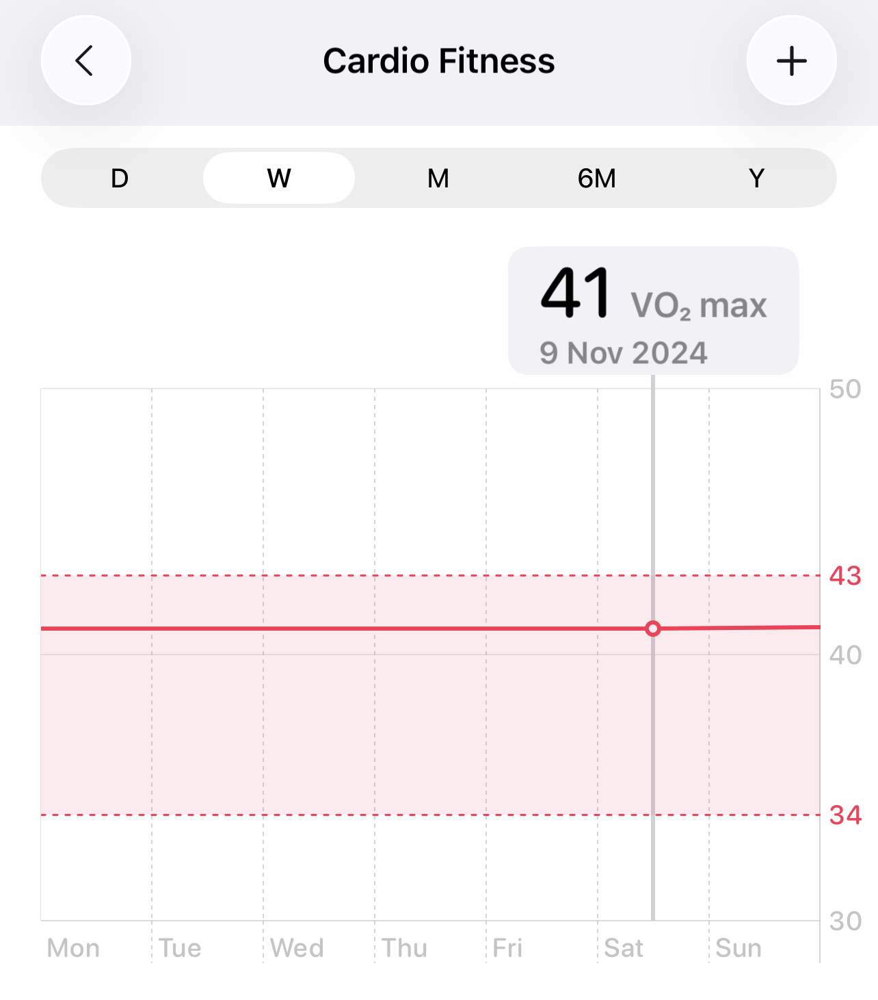
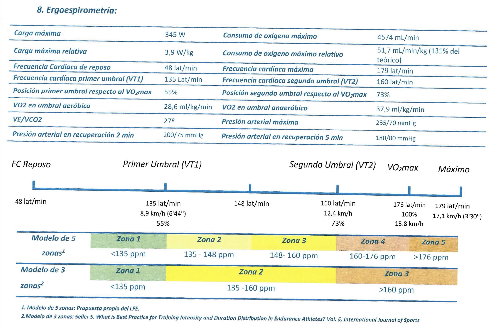
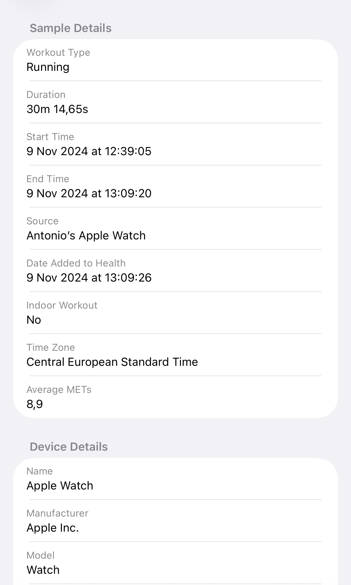
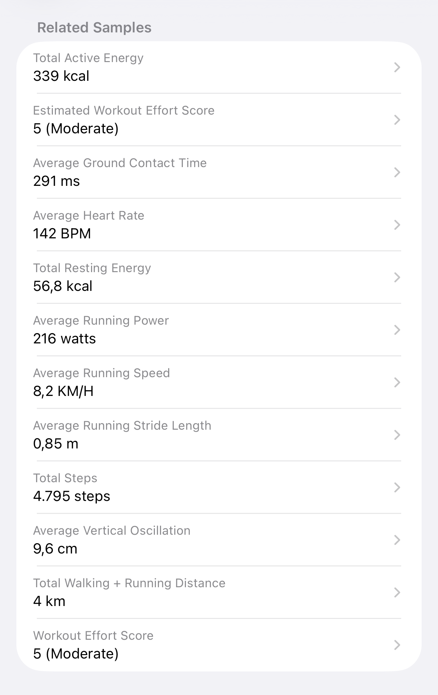
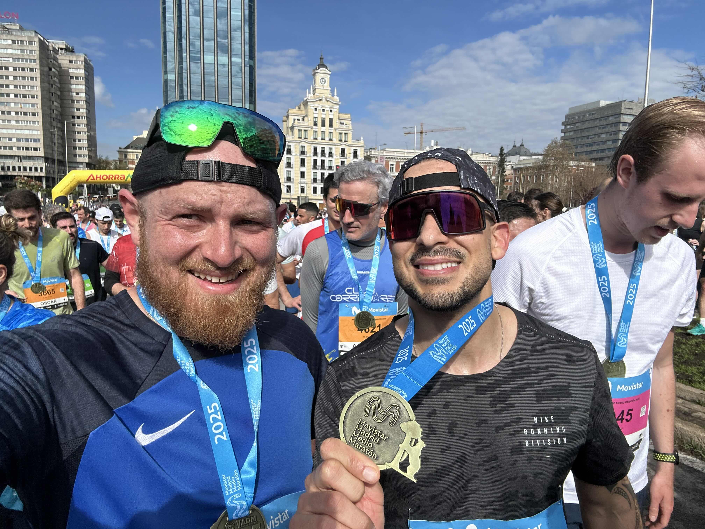
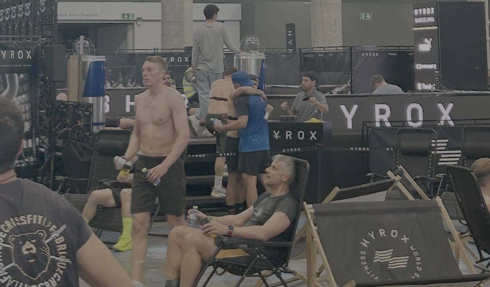
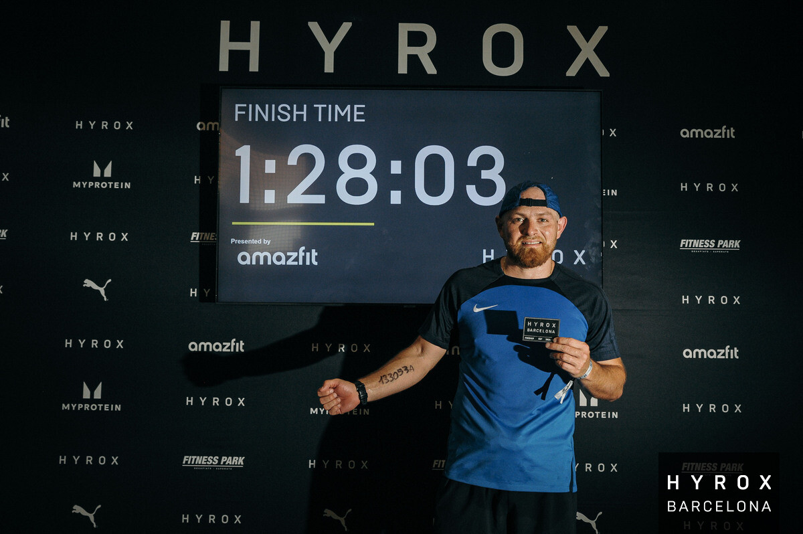
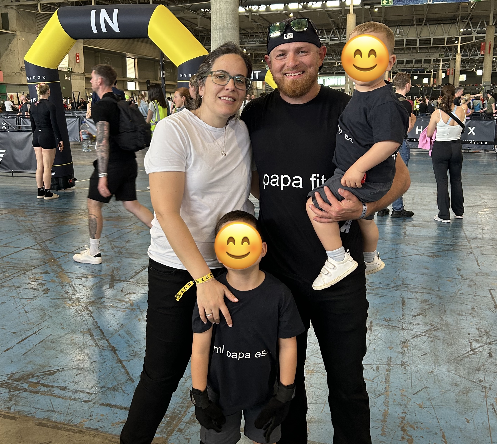

Three days from today (2024-11-09) marks a year since my first running workout and it is just amazing to look back and see how things have changed.

|      |       |
| :-------------: | :-------------: |
| _VO2 Max - Nov 2024_ | _VO2 Max - Oct 2025_ |

I used to dislike running very much. I just didn't get it. To me it seemed like such a boring activity that I had zero interest in getting involved with. That changed when I decided to start training for a HYROX event (April 2025). HYROX combines both running & functional workout stations, where you run 1km, followed by 1 functional workout station, repeat that eight times. In the end, you spend most of the time running as part of the race. If I wanted to do a HYROX, I had to start running, so I started researching how to get into running.

At the beginning, I was just like... ok I'll go for a 30 min run. I read a lot of how you need to do Zone 2 training as part of your running and with the help of my Apple Watch and a heart rate monitor strap, I was able to see my heart rate while running. What a surprise it was to see that even though I was running slowly my heart rate was already high and to keep it in Zone 2 I had to run very slow, like jogging speed. That first training session was tough and boring hehe. My average running speed was 8.2 km/hr and my Apple Watch stated that my VO2 Max was 41. Fortunately, I knew that with consistent training, my cardiovascular system would improve with time and I would get better at it.

|      |       |
| :-------------: | :-------------: |
| _First run_ | _Stats_ |

To keep me motivated, I decided to sign up for a half-marathon (March 2025) and I was fortunate enough to have my good friend Cesar running with me. He didn't just ran with me but also help clarify the 1000s questions that I had related to running. I started a half marathon training plan and did my best to follow it.

As time went by I started to see improvements. My VO2 max started to increase, my pace was faster for my Zone 2 and best of all, I started to enjoy running. Podcasts and audiobooks help a lot with that :-).

**March 2025**, We ran the Movistar Half Marathon in Madrid with Cesar. It was my first half marathon and I completed it in 1:43:10. I only managed to make that time as Cesar paced me and kept me motivated in that last km which lasted an eternity hehe.

|  |
| :-------------: |
| _Movistar Madrid Half Marathon_ |

**April 2025**, HYROX event day arrived. Although I got sick the week before the event, I was able to complete the race in 1:28:03. Not bad but although I did run a lot to prepare for it, I knew that I just need to run a lot more to be able to run better while fatigued after the functional stations.

|      |       |
| :-------------: | :-------------: |
| _Completed my 1st HYROX_ | _Time_ |

Since then, I have been running consistently. Now, I look forward to my runs and even feel a bit disappointed if I have to miss one. I'm following a running training program focused on HYROX, which involves running in combination with functional workouts, as I'm preparing for another race soon. I'm quite happy to see how my running has improved significantly. My average pace for Zone 2 runs is now below 5:40 min/km and my VO2 max is 51.7 - I got this tested in a proper lab with the face mask and everything.

|  |
| :-------------: |
| _Support Crew_ |

Honestly, none of this would be possible if it wasn't for the support of those around me 🧑‍🧑‍🧒‍🧒. I'm now looking forward to my next year of running and see how, slowly but surely, I keep progressing and improving my running performance.
